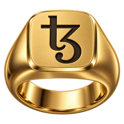

  

<h1 align="center">Signet</h1>

A Tezos wallet for the Mac.

We are writing a wallet using Claude.AI for Tezos. It is for Macs only.
ChatGPT made the Macintosh App icon.

*Disclaimer:* This is very very new software. There is absolutely no warranty. If it breaks you get to keep ALL the pieces. Use at your own risk. Keys can be kept encrypted with a password (the default on mainnet) or on a Ledger; unencrypted keys on disk are only sensible on test networks.

## Frequently Asked Questions

### Why are you doing this then?

Simply because I haven't attempted a project in Swift using AI before. All the code is written by Claude. Codex is auditing it. It is an exercise in using AI for software development. The winter nights are drawing in. The TV offerings on Netflix and Prime are not what they used to be. Also having a nice shiny wallet for Tezos on the Mac won't hurt anyone.

### Will it steal my keys?

Probably not. Codex will be checking what Claude is doing. But of course, you can read the sources too.

### Will you be adding XYZ feature any time soon?

Ping me and we can queue it up. Work on this will be between other things and might fall right down the stack.
